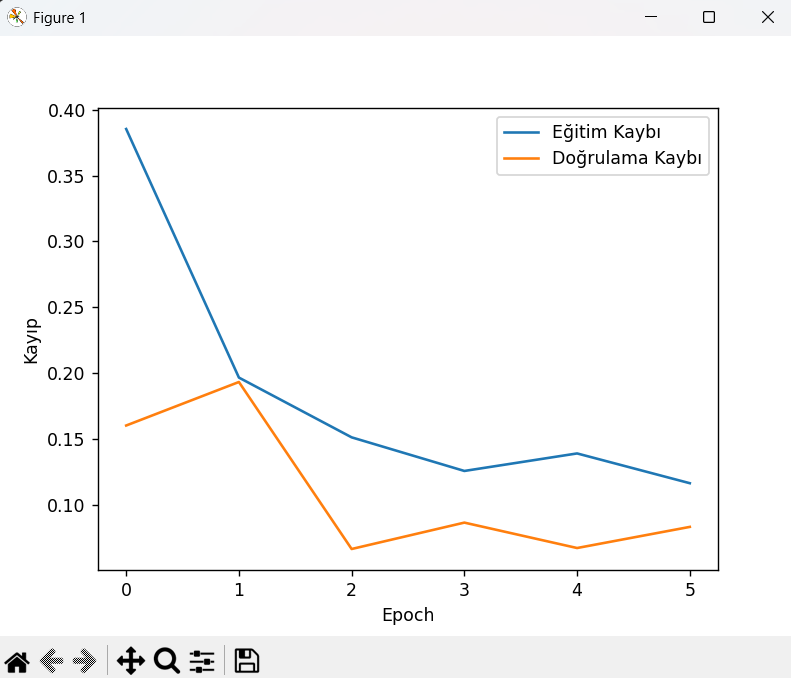
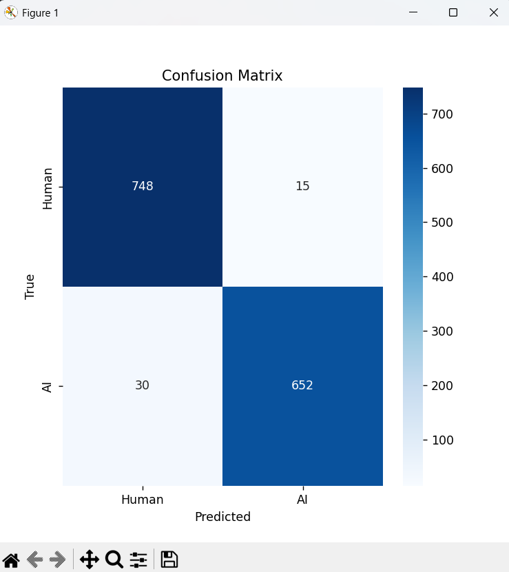
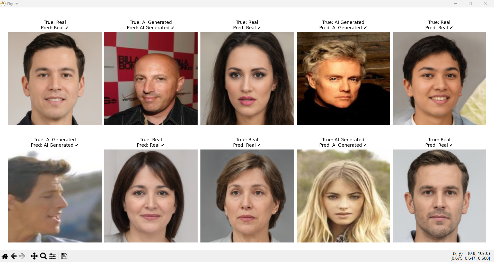

# AI-Generated vs. Human Face Classification


This project implements a **Convolutional Neural Network (CNN)** to distinguish between real human faces and synthetic faces generated by Artificial Intelligence. Developed as part of a research study at Fırat University.

## 📌 Project Overview
With the rise of GANs (Generative Adversarial Networks), distinguishing between real and synthetic media has become crucial for digital security. This project focuses on binary classification of facial images using deep learning techniques.

### Key Results:
* **Dataset Size:** 9,936 images (5,000 Real, 4,936 AI-generated).
* **Model:** Custom CNN architecture with 3 Convolutional blocks.
* **Performance:** High precision and F1-score in detecting synthetic artifacts.

---

## 📂 Dataset
The dataset used in this study is the **Human Faces Dataset** sourced from Kaggle.
* **Source:** [Kaggle - Human Faces Dataset](https://www.kaggle.com/datasets/kaustubhdhote/human-faces-dataset)
* **Structure:**
    * `human/`: 5,000 images of real individuals.
    * `ai/`: 4,936 images of AI-generated faces.

> **Note:** Due to size constraints, the dataset is not included in this repository. Please download it from the link above and place it in the `data/` directory.

---

## 📊 Experimental Results
Based on the experimental findings in the technical paper:

### Evaluation Metrics
| Metric | Performance |
| :--- | :---: |
| **Accuracy** | High |
| **F1-Score** | Optimized |
| **Loss** | Minimized via Adam Optimizer |

### Training Visualization
Below are the training curves and the confusion matrix showing the model's ability to minimize false positives.



### Sample Predictions
Randomly selected samples from the test set. 


---

## 🛠️ Technical Implementation
1.  **Preprocessing:** Images resized to 224x224 and normalized (1/255).
2.  **Architecture:**
    * 3x Conv2D Layers (32, 64, 128 filters) with ReLU activation.
    * MaxPooling layers for spatial reduction.
    * Dropout (0.5) to prevent overfitting.
    * Sigmoid output for binary classification.
3.  **Optimization:** Adam optimizer with Binary Crossentropy loss.

---

## 🚀 Getting Started

1. **Clone the repo:**
   ```bash
   git clone [https://github.com/YourUsername/AI-vs-Human-Face-Classification.git](https://github.com/YourUsername/AI-vs-Human-Face-Classification.git)

